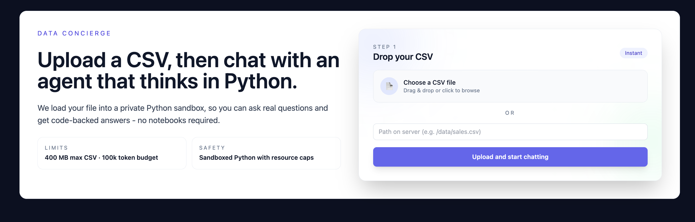

# Data Analyst Agent

**AI-powered CSV analysis chatbot** with natural language interface. Upload your data, ask questions, get insights with tables and charts.



## Features

- **Natural Language Queries** - Ask questions about your data in plain English
- **Large File Support** - Handle CSV files up to 400MB with automatic Parquet conversion
- **Interactive Tables** - Paginated data views with column info and type details
- **Chart Generation** - Auto-generate bar, line, column, stacked, and scatter charts
- **Real-time Streaming** - See analysis progress with Server-Sent Events
- **Sandboxed Execution** - Safe Python REPL with memory/process/time limits
- **Smart Token Management** - Automatic conversation compaction at 100k tokens

## Tech Stack

**Backend:**
- FastAPI + Python 3.11
- OpenAI Responses API (GPT-5.1)
- Sandboxed Python REPL (2GB RAM, 8 subprocesses, 15-min timeout)
- pandas, numpy, PyArrow for data processing

**Frontend:**
- Next.js 15.1 + React 18.3.1
- TypeScript + Tailwind CSS
- shadcn/ui components
- Recharts for visualization
- react-markdown for formatted responses

**Deployment:**
- Docker + docker-compose
- Backend: 4GB limit, port 8105
- Frontend: port 3001

## Quick Start

### Prerequisites
- Docker and docker-compose
- OpenAI API key with Responses API access

### Setup

1. **Clone and configure:**
```bash
git clone <repository-url>
cd data-analyst
```

2. **Create `.env` file:**
```bash
OPENAI_API_KEY=sk-...

# Optional
ENABLE_RESPONSES_STREAMING=0
DATA_ROOT=/data
DATA_EVENT_ENCRYPT=0
DATA_EVENT_KEY=your-secret-key
```

3. **Build and run:**
```bash
docker compose build --no-cache
docker compose up -d
```

4. **Access the app:**
- Frontend: http://localhost:3001
- Backend API: http://localhost:8105

### View Logs
```bash
# All services
docker compose logs -f

# Backend only
docker compose logs -f backend

# Frontend only
docker compose logs -f frontend
```

### Stop
```bash
docker compose down
```

## How It Works

### 1. Upload
- Upload CSV file (or provide server path)
- Automatic conversion to Parquet format
- Stored in session-isolated directory
- Dataset registered for analysis

### 2. Chat & Analyze
- Type natural language questions
- Backend agent loop with OpenAI Responses API:
  - Calls tools (`python_repl`, `load_dataset_full`, etc.)
  - Executes code in sandboxed Python REPL
  - Generates tables and charts
- Real-time streaming updates via SSE

### 3. View Results
- **Summary tab:** AI-generated insights and explanations
- **Data tab:** Paginated tables with column info
- **Charts tab:** Interactive visualizations
- **Activity panel:** Tool calls, token usage, execution log

### 4. Token Management
- Tracks input/output tokens (100k limit)
- Auto-compacts conversation history when exceeded
- Keeps recent messages + tool outputs + summary

## Architecture

### Backend (`backend/`)
- **main.py** - FastAPI endpoints (`/upload`, `/chat`, `/chat/stream`, `/reset`)
- **agent.py** - Agent loop, Responses API integration, event emission
- **session.py** - Session state, Python REPL, resource limits
- **tools.py** - Tool registry (9 tools for data analysis)
- **data_events.py** - Data/chart event generation and encryption

### Frontend (`frontend/`)
- **app/page.tsx** - Upload page
- **app/chat/ChatClient.tsx** - Main chat interface (3-panel layout)
- **components/ui/paginated-table.tsx** - Data table component
- **components/ui/chart-card.tsx** - Chart visualization component
- **lib/decrypt.ts** - Event payload decryption

### Key Patterns
- **Parquet-first:** All CSV → Parquet for performance
- **Event-driven data:** Tables/charts via encrypted events
- **Sandboxed REPL:** Resource-limited Python execution
- **Streaming SSE:** Real-time updates to frontend
- **Token budget:** Auto-compaction with history management

## Development

### Local Backend (Hot Reload)
```bash
cd backend
pip install -r requirements.txt
uvicorn main:app --reload --port 8105
```

### Local Frontend (Hot Reload)
```bash
cd frontend
npm install
npm run dev  # Runs on port 3001

# Configure backend URL
echo "NEXT_PUBLIC_API_BASE=http://localhost:8105" > .env.local
```

### Testing
```bash
# Backend syntax check
python -m py_compile backend/agent.py backend/main.py backend/session.py

# Backend tests
cd backend
pytest

# Frontend build check
cd frontend
npm run build
npm run lint
```

## Available Tools (9)

The agent has access to these tools for data analysis:

1. **python_repl** - Execute Python code in persistent REPL
2. **list_datasets** - Show registered datasets
3. **get_dataset_info** - Get schema without loading data
4. **load_dataset_full** - Load entire Parquet file
5. **load_dataset_sample** - Load first N rows
6. **load_dataset_columns** - Load specific columns
7. **find_value_columns** - Search for values across columns
8. **send_data_to_ui_as_df** - Emit table to frontend
9. **send_chart_to_ui** - Emit chart spec for visualization

## Configuration

### Environment Variables
- `OPENAI_API_KEY` - Required. Your OpenAI API key
- `ENABLE_RESPONSES_STREAMING` - Optional. Enable streaming (0 or 1, default: 0)
- `DATA_ROOT` - Optional. Data storage path (default: `/data`)
- `DATA_EVENT_ENCRYPT` - Optional. Enable event encryption (0 or 1, default: 0)
- `DATA_EVENT_KEY` - Optional. Encryption key for events

### Resource Limits (Backend)
- **Memory:** 2GB per session (RLIMIT_AS)
- **Subprocesses:** 8 max (RLIMIT_NPROC)
- **Timeout:** 15 minutes per execution (SIGALRM)
- **DataFrame pruning:** Auto-prune when total > 500MB
- **Upload limit:** 400MB max file size

## Documentation

- **Claude.md** - Comprehensive project reference (architecture, APIs, patterns)
- **AGENTS.md** - Agent behavior guide and API documentation
- **plans/** - Architectural plans and design documents
  - `agent-notes.md` - Technical notes on agent loop and tools
  - `overhaul-plan.md` - Architecture refactoring roadmap
  - `tools-migration-plan.md` - Tool registry migration
  - `data-delivery-plan.md` - Data event encryption strategy
  - `chart-plan.md` - Chart feature design

## Troubleshooting

### CSV Upload Issues
- Check file size (max 400MB)
- Verify encoding (UTF-8 preferred)
- Check logs: `docker compose logs backend`

### Python Timeout
- Default: 15 minutes
- Increase in `backend/session.py` if needed
- Check memory usage (2GB limit)

### Charts Not Rendering
- Check browser console for errors
- Verify chart has ≤200 rows, ≤10 series
- Ensure y_field is numeric for bar/line charts

### Token Limit
- Auto-compacts at 100k tokens
- Use `/reset` endpoint to clear history
- Check conversation length

## API Endpoints

- `POST /upload` - Upload CSV or register path
- `POST /chat` - Synchronous chat (returns final reply)
- `POST /chat/stream` - SSE streaming chat (real-time updates)
- `POST /reset` - Clear session history
- `GET /health` - Health check

See **Claude.md** for detailed API reference.

## Current Status

### ✅ Implemented
- Full CSV upload and Parquet conversion
- OpenAI Responses API with function calling
- 9 data analysis tools
- Sandboxed Python REPL
- Token budget management
- SSE streaming
- Data tables with pagination
- Charts (5 types)
- Event encryption
- Activity logging

### ⏳ Planned
- Event/Op dispatcher with async queuing
- Full streaming (currently partial)
- Telemetry and metrics (Prometheus)
- Session persistence (Redis)
- Export for large datasets

## Contributing

1. Create feature branch from `main`
2. Make changes with tests
3. Test locally with Docker
4. Submit PR with description

See **Claude.md** for code style guide and adding new tools.

## License

[Add license]

## Contact

[Add contact]
